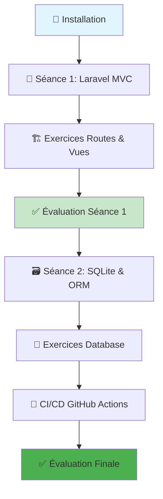

# 📚 Documentation Bibliotech Laravel - BTS SIO SLAM

**Projet de formation Laravel pour BTS SIO spécialité SLAM**

---

## 📋 Vue d'Ensemble

Cette documentation accompagne le projet **Bibliotech Laravel**, une application de gestion de bibliothèque développée avec Laravel 11.31.1 pour la formation BTS SIO SLAM. 

### 🎯 Objectifs Pédagogiques

- ✅ **Maîtriser le framework Laravel** (MVC, Routing, Eloquent ORM)
- ✅ **Comprendre les bases de données** (SQLite, migrations, relations)
- ✅ **Implémenter des interfaces CRUD** (Create, Read, Update, Delete)
- ✅ **Configurer des pipelines CI/CD** (GitHub Actions, tests automatisés)
- ✅ **Déployer des applications modernes** (GitHub Codespace, production)

---

## 📁 Structure de la Documentation

### **🚀 Guides de Démarrage**

| 📖 Document | 🎯 Objectif | ⏱️ Durée |
|-------------|-------------|----------|
| [`INSTALLATION-LOCAL.md`](INSTALLATION-LOCAL.md) | Installer Laravel en local | 15 min |
| [`INSTALLATION-CODESPACE.md`](INSTALLATION-CODESPACE.md) | Utiliser GitHub Codespace | 10 min |
| [`TROUBLESHOOTING.md`](TROUBLESHOOTING.md) | Résoudre les problèmes courants | Référence |
| [`PROGRESSION.md`](PROGRESSION.md) | Suivre l'avancement du projet | Suivi |

### **📖 Séances de Formation**

#### **🏗️ Séance 1 : Fondations Laravel (3h)**
| 📄 Fichier | 📝 Description |
|-------------|----------------|
| [`seance-01/00-README.md`](seance-01/00-README.md) | Vue d'ensemble de la séance 1 |
| [`seance-01/01-CONCEPTS-MVC.md`](seance-01/01-CONCEPTS-MVC.md) | Architecture MVC avec Laravel |
| [`seance-01/02-GLOSSAIRE-LARAVEL.md`](seance-01/02-GLOSSAIRE-LARAVEL.md) | Vocabulaire et concepts clés |
| [`seance-01/03-TP-DECOUVERTE-APP.md`](seance-01/03-TP-DECOUVERTE-APP.md) | Découverte de l'application |
| [`seance-01/04-TP-ROUTES-SIMPLES.md`](seance-01/04-TP-ROUTES-SIMPLES.md) | Routing et contrôleurs |
| [`seance-01/05-EXERCICES-PRATIQUES.md`](seance-01/05-EXERCICES-PRATIQUES.md) | Exercices pratiques |
| [`seance-01/06-EVALUATION-COMPETENCES.md`](seance-01/06-EVALUATION-COMPETENCES.md) | Évaluation des acquis |

#### **🗃️ Séance 2 : Base de Données SQLite & CI/CD (3h)**
| 📄 Fichier | 📝 Description |
|-------------|----------------|
| [`seance-02/00-README.md`](seance-02/00-README.md) | Vue d'ensemble de la séance 2 |
| [`seance-02/00-PRESENTATION-SEANCE-02.md`](seance-02/00-PRESENTATION-SEANCE-02.md) | Support de présentation enseignant |
| [`seance-02/01-CONCEPTS-DATABASE.md`](seance-02/01-CONCEPTS-DATABASE.md) | Concepts fondamentaux SQLite & ORM |
| [`seance-02/02-GLOSSAIRE-ELOQUENT.md`](seance-02/02-GLOSSAIRE-ELOQUENT.md) | Glossaire technique Eloquent |
| [`seance-02/03-TP-DECOUVERTE-DATABASE.md`](seance-02/03-TP-DECOUVERTE-DATABASE.md) | TP exploration base de données |
| [`seance-02/04-TP-MIGRATIONS.md`](seance-02/04-TP-MIGRATIONS.md) | TP création de migrations |
| [`seance-02/05-EXERCICES-PRATIQUES.md`](seance-02/05-EXERCICES-PRATIQUES.md) | Exercices détaillés (5 modules) |
| [`seance-02/06-EVALUATION-COMPETENCES.md`](seance-02/06-EVALUATION-COMPETENCES.md) | Test d'évaluation 45 min |
| [`seance-02/07-CICD-GITHUB-ACTIONS.md`](seance-02/07-CICD-GITHUB-ACTIONS.md) | Pipeline CI/CD avec GitHub Actions |
| [`seance-02/08-QUICK-START-SQLITE.md`](seance-02/08-QUICK-START-SQLITE.md) | Guide de démarrage rapide SQLite |

---

## 🛠️ Environnements de Développement

### **💻 Option 1 : Installation Locale**

```bash
# Pré-requis
- PHP 8.3+
- Composer
- Node.js 18+
- SQLite

# Installation rapide
git clone https://github.com/ggaillard/bibliotech-laravel-bts-sio.git
cd bibliotech-laravel-bts-sio
composer install
npm install
cp .env.example .env
php artisan key:generate
php artisan migrate --seed
php artisan serve
```

📖 **Guide complet :** [`INSTALLATION-LOCAL.md`](INSTALLATION-LOCAL.md)

### **☁️ Option 2 : GitHub Codespace (Recommandé)**

```bash
# Démarrage en 1 clic
1. Aller sur le dépôt GitHub
2. Cliquer sur "Code" > "Codespaces" > "Create codespace"
3. Attendre le setup automatique (2-3 minutes)
4. L'application est prête à l'URL fournie
```

📖 **Guide complet :** [`INSTALLATION-CODESPACE.md`](INSTALLATION-CODESPACE.md)

---

## 🎓 Parcours de Formation

### **📈 Progression Recommandée**



### **⏱️ Planning Suggéré**

| 🗓️ Session | 📖 Contenu | ⏰ Durée | 🎯 Objectifs |
|-------------|-------------|----------|--------------|
| **Jour 1** | Installation + Séance 1 | 3h30 | Bases Laravel MVC |
| **Jour 2** | Séance 2 | 3h | SQLite + Eloquent ORM |
| **Jour 3** | CI/CD + Projet final | 3h | Pipeline automatisé |

---

## 🔧 Technologies Utilisées

### **🏗️ Backend**
- **Laravel 11.31.1** - Framework PHP moderne
- **PHP 8.3+** - Langage de programmation
- **SQLite** - Base de données légère et portable
- **Eloquent ORM** - Mapping objet-relationnel

### **🎨 Frontend**
- **Blade Templates** - Moteur de template Laravel
- **Bootstrap 5** - Framework CSS responsive
- **Vite** - Build tool moderne et rapide

### **🚀 DevOps**
- **GitHub Actions** - CI/CD automatisé
- **GitHub Codespace** - Environnement cloud
- **Composer** - Gestionnaire de dépendances PHP
- **NPM** - Gestionnaire de packages Node.js

---

## 📊 Structure du Projet

```
bibliotech-laravel/
├── app/                    # Logique métier Laravel
│   ├── Http/Controllers/   # Contrôleurs MVC
│   └── Models/             # Modèles Eloquent
├── database/               # Base de données
│   ├── migrations/         # Schémas de tables
│   └── seeders/            # Données de test
├── resources/              # Ressources front-end
│   ├── views/              # Templates Blade
│   ├── css/                # Styles CSS
│   └── js/                 # JavaScript
├── routes/                 # Définition des routes
├── public/                 # Fichiers publics
├── docs/                   # 📚 Cette documentation
└── .github/workflows/      # Pipelines CI/CD
```

---

## 🆘 Support et Aide

### **❓ Questions Fréquentes**

- **Erreur 500** → Vérifier les logs dans `storage/logs/laravel.log`
- **Base vide** → Lancer `php artisan migrate:fresh --seed`
- **Styles cassés** → Exécuter `npm run build`
- **Permissions** → Vérifier les droits sur `storage/` et `bootstrap/cache/`

### **🔍 Ressources d'Aide**

| 📖 Ressource | 🔗 Lien | 💬 Description |
|---------------|---------|----------------|
| **Documentation Laravel** | [laravel.com/docs](https://laravel.com/docs) | Documentation officielle |
| **Laracasts** | [laracasts.com](https://laracasts.com) | Tutoriels vidéo Laravel |
| **Laravel News** | [laravel-news.com](https://laravel-news.com) | Actualités et tips |
| **GitHub Issues** | [Issues du projet](https://github.com/ggaillard/bibliotech-laravel-bts-sio/issues) | Support technique |

### **🚨 Dépannage**

📖 **Guide complet :** [`TROUBLESHOOTING.md`](TROUBLESHOOTING.md)

---

## 🏆 Évaluation et Validation

### **✅ Critères de Réussite**

#### **Séance 1 : Laravel MVC**
- [ ] Comprendre l'architecture MVC
- [ ] Créer des routes personnalisées
- [ ] Utiliser les contrôleurs et vues
- [ ] Manipuler les données avec Blade

#### **Séance 2 : Base de Données**
- [ ] Créer des migrations SQLite
- [ ] Développer des modèles Eloquent
- [ ] Implémenter des relations
- [ ] Maîtriser les requêtes ORM

### **🎖️ Compétences Acquises**

À l'issue de cette formation, vous maîtriserez :

- ✅ **Développement web moderne** avec Laravel
- ✅ **Architecture MVC** et bonnes pratiques
- ✅ **Gestion de base de données** avec ORM
- ✅ **Intégration continue** et déploiement
- ✅ **Travail collaboratif** avec Git/GitHub

---

## 📞 Contact et Contributions

### **👨‍🏫 Formateur**
- **Nom :** Guillaume Gaillard  
- **Email :** [votre.email@example.com]
- **GitHub :** [@ggaillard](https://github.com/ggaillard)

### **🤝 Contribuer**

Les contributions sont les bienvenues ! 

1. **Fork** le projet
2. **Créer** une branche feature (`git checkout -b feature/amelioration`)
3. **Commit** vos changements (`git commit -m 'Ajout fonctionnalité'`)
4. **Push** vers la branche (`git push origin feature/amelioration`)
5. **Ouvrir** une Pull Request

---

**🚀 Bon apprentissage avec Laravel et BTS SIO SLAM !**

> 💡 **Conseil :** Commencez par l'installation puis suivez les séances dans l'ordre pour une progression optimale.