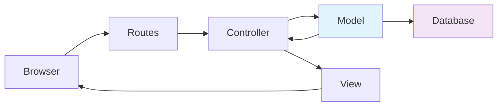
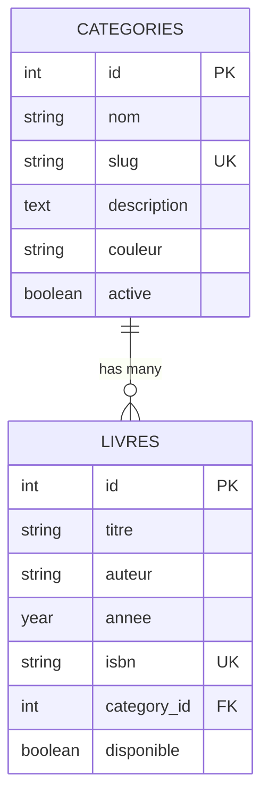

<!-- _class: lead -->
<!-- _paginate: false -->
<!-- _header: "" -->
<!-- _footer: "" -->

# 📊 **Séance 2**
## Base de Données SQLite & Eloquent ORM

**Formation Laravel - BTS SIO SLAM**
*Durée : 3 heures*

---

## 🎯 **Objectifs Pédagogiques**

À l'issue de cette séance, les étudiants seront capables de :

✅ **Créer des migrations Laravel** pour structurer une base SQLite
✅ **Développer des modèles Eloquent** avec relations  
✅ **Utiliser les seeders** pour alimenter la base
✅ **Manipuler SQLite** via Tinker et Eloquent

---

## 🎯 **Objectifs Complémentaires**

✅ **Configurer un pipeline CI/CD** avec GitHub Actions
✅ **Maîtriser les relations** one-to-many (livre → catégorie)
✅ **Comprendre les contraintes** et l'intégrité référentielle

---

## 📚 **Plan de la Séance**

### **Phase 1** - Concepts (30 min)
- 📖 Fondamentaux base de données relationnelle
- 🏗️ SQLite vs autres SGBD
- 🔄 Migrations et Schema Builder

### **Phase 2** - Pratique Guidée (90 min)
- 🔍 Découverte structure existante
- 🛠️ Création de migrations
- 🧪 Tests avec Tinker
  
---

### **Phase 3** - Exercices Autonomes (45 min)
- 💪 Exercices progressifs
- 🎯 Validation des acquis

### **Phase 4** - CI/CD et Synthèse (15 min)
- 🚀 Pipeline automatisé
- 📝 Bilan et préparation séance 3

---

## 🏗️ **Rappel : Architecture MVC Laravel**



**Aujourd'hui : Focus sur Model ↔ Database**

---

## 📊 **Évolution : Données en Dur → Base de Données**

### **Séance 1 : Données Statiques**
```php
// Dans le Controller
$livres = [
    ['titre' => 'Laravel 11', 'auteur' => 'Expert'],
    ['titre' => 'PHP 8.4', 'auteur' => 'Développeur']
];
```

### **Séance 2 : Base de Données SQLite**
```php
// Modèle Eloquent
$livres = Livre::with('category')->get();
$livresDisponibles = Livre::disponible()->get();
```

**🎯 Objectif : Données persistantes et relationnelles**

---

## 🗄️ **Pourquoi SQLite ?**

### **✅ Avantages Pédagogiques**
- 📁 **Fichier unique** : `database/database.sqlite`
- ⚡ **Installation zero** : Intégré à PHP
- 🔧 **Configuration simple** : Idéal apprentissage

### **📈 Production-Ready**
- 🌐 Utilisé par Discord, Airbnb, Dropbox
- 📱 Base de données mobile de référence

---

## 🏗️ **Schema de Base de Données Final**



**Relation One-to-Many : Une catégorie → Plusieurs livres**

---

## 🔄 **Migrations Laravel**

### **Qu'est-ce qu'une Migration ?**
> 📝 **Fichier PHP** qui décrit les modifications BDD
> 🕒 **Versioning** : Historique des changements
> 🔄 **Réversible** : Up/Down pour rollback

---

## 🔄 **Exemple de Migration**

```php
Schema::create('livres', function (Blueprint $table) {
    $table->id();
    $table->string('titre');
    $table->string('auteur');
    $table->year('annee')->nullable();
    $table->foreignId('category_id')
          ->constrained('categories');
    $table->timestamps();
});
```

---

## 🏗️ **Eloquent ORM**

### **Qu'est-ce qu'un ORM ?**
> 🔄 **Object-Relational Mapping**
> 🎯 Traduit Tables → Objets PHP
> 📝 Requêtes SQL → Méthodes PHP

---

## 🏗️ **Modèle Eloquent**

```php
class Livre extends Model
{
    protected $fillable = [
        'titre', 'auteur', 'category_id'
    ];
    
    // Relation belongsTo
    public function category()
    {
        return $this->belongsTo(Category::class);
    }
}
```

---

## 🔗 **Relations Eloquent**

### **belongsTo (N:1)**
```php
// Un livre appartient à une catégorie
$livre = Livre::find(1);
echo $livre->category->nom; // "PHP"
```

### **hasMany (1:N)**
```php
// Une catégorie a plusieurs livres
$category = Category::find(1);
echo $category->livres()->count(); // 5 livres
```

---

## ⚡ **Performance : Eager Loading**

```php
// ❌ Problème N+1 queries
$livres = Livre::all();
foreach ($livres as $livre) {
    echo $livre->category->nom; // 1 requête par livre !
}

// ✅ Solution : Eager Loading
$livres = Livre::with('category')->get(); // 2 requêtes seulement
```

---

## 🌱 **Seeders : Pourquoi ?**

- 🎯 **Données cohérentes** pour tous les développeurs
- 🧪 **Tests reproductibles**
- 🚀 **Déploiement rapide**

---

## 🌱 **Exemple CategorySeeder**

```php
Category::create([
    'nom' => 'PHP',
    'slug' => 'php',
    'description' => 'Livres sur PHP',
    'couleur' => '#777BB4'
]);

Category::create([
    'nom' => 'Laravel',
    'slug' => 'laravel',
    'description' => 'Framework Laravel',
    'couleur' => '#FF2D20'
]);
```

**Résultat : 6 catégories + 6 livres avec relations**

---

## 🧪 **Tinker : REPL Laravel**

```bash
php artisan tinker
```

### **Explorer la Structure**
```php
>>> Schema::getColumnListing('livres')
>>> DB::select("SELECT * FROM categories LIMIT 3")
```

---

## 🧪 **Tinker : Tester les Relations**

```php
// Tester les relations
>>> App\Models\Livre::with('category')->first()
>>> App\Models\Category::find(1)->livres()->count()

// Requêtes avancées
>>> App\Models\Livre::where('disponible', true)->get()
```

**🎯 Outil indispensable pour le debug**

---

## 💻 **Démonstration Live**

### **🎬 Scenario : Créer un nouveau livre**

1. **Vérifier les catégories**
2. **Créer un livre via Tinker**
3. **Tester la relation**
4. **Afficher dans la vue**

```bash
php artisan tinker
```

---

## 🚀 **CI/CD avec GitHub Actions**

### **Pipeline Automatisé**
```yaml
🧪 Tests PHP 8.3 & 8.4
🔍 Analyse statique PHPStan  
🎨 Style de code Laravel Pint
🔒 Audit sécurité Composer
```

---

## 🚀 **Avantages CI/CD**

- ✅ **Qualité garantie** à chaque commit
- 🔄 **Intégration continue**
- 📈 **Détection précoce** des bugs
- 📊 **Coverage** et métriques

---

## 📚 **Travail Pratique : Organisation**

### **🔍 Phase Découverte (30 min)**
- **TP1** : Explorer la base existante avec Tinker
- **TP2** : Analyser les relations entre tables
- **TP3** : Tester les requêtes Eloquent

### **🛠️ Phase Construction (60 min)**
- **TP4** : Créer une nouvelle migration
- **TP5** : Modifier le modèle Livre
- **TP6** : Mettre à jour les seeders

### **💪 Phase Validation (30 min)**
- **TP7** : Exercices progressifs (5 modules)
- **TP8** : Tests de performance

---

## 🎯 **Évaluation : 20 Points**

### **📊 Répartition**
- **Partie 1** : Migrations (4 pts)
- **Partie 2** : Modèles Eloquent (4 pts)
- **Partie 3** : Relations (4 pts)
- **Partie 4** : Requêtes avancées (4 pts)
- **Partie 5** : Optimisation (4 pts)

### **🕒 Durée : 45 minutes**

---

## 🔧 **Outils Requis**

### **📋 Checklist Technique**
- [ ] PHP 8.3+ installé
- [ ] Laravel 11+ configuré
- [ ] SQLite extension activée
- [ ] Git repository configuré
- [ ] VS Code avec extensions Laravel

---

## 📚 **Documentation**

- Laravel Migrations : `laravel.com/docs/migrations`
- Eloquent ORM : `laravel.com/docs/eloquent`
- SQLite Laravel : `laravel.com/docs/database#sqlite`

---

## ⚡ **Commandes Essentielles**

### **🗄️ Base de Données**
```bash
# Créer le fichier SQLite
touch database/database.sqlite

# Exécuter les migrations
php artisan migrate

# Reset complet avec données
php artisan migrate:fresh --seed
```

---

## ⚡ **Commandes Debug**

### **🧪 Tests et Debug**
```bash
# Interface interactive
php artisan tinker

# Tests automatisés
php artisan test

# Status des migrations
php artisan migrate:status
```

---

## 🎓 **Préparation Séance 3**

### **🔮 Aperçu Séance 3 : CRUD & Formulaires**
- 📝 **Formulaires** création/édition livres
- ✅ **Validation** côté serveur
- 🔄 **CRUD complet** (Create, Read, Update, Delete)

---

## 📋 **Prérequis Séance 3**

- ✅ Base SQLite opérationnelle
- ✅ Relations maîtrisées
- ✅ Modèles Eloquent fonctionnels
- ✅ Confort avec Tinker

---

## 🎯 **Objectifs de Fin de Séance**

### **✅ Validation Attendue**
- Base SQLite avec 2 tables liées
- 6 catégories + 6 livres créés
- Relations testées et fonctionnelles
- Pipeline CI/CD opérationnel

---

## 💡 **Conseil Enseignant**

> **Insister sur Tinker** : Les étudiants doivent être à l'aise avec cet outil avant les exercices autonomes.

> **Vérifier les relations** : Tester `$livre->category` et `$category->livres()` pour chaque étudiant.

---

<!-- _class: lead -->
<!-- _paginate: false -->

# 🚀 **À Vos Claviers !**

## Questions avant de commencer ?

**Bonne séance et bon développement ! 👨‍💻👩‍💻**

---

<!-- _class: lead -->
<!-- _paginate: false -->
<!-- _backgroundColor: #f8f9fa -->

# 📋 **Aide-Mémoire**

### **Commandes Fréquentes**
```bash
php artisan migrate:status    # État migrations
php artisan tinker           # Interface interactive
php artisan migrate:fresh    # Reset complet
git status                   # État repository
```

